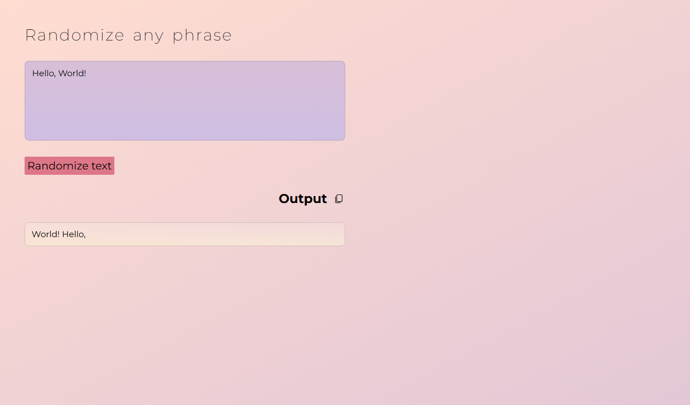
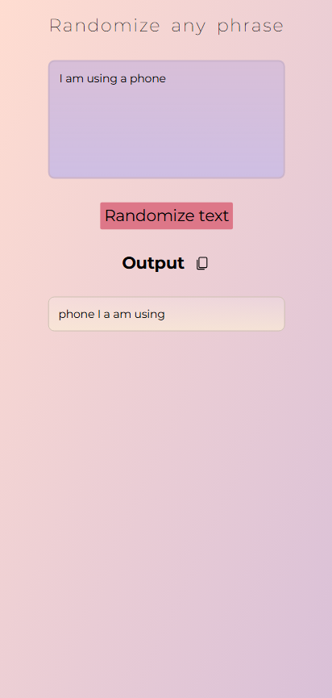

# Word Randomizer

A creative web application built with Vue 3 that takes your text input and scrambles the order of the words. Perfect for creative writing prompts, games, or just for fun! Use with caution: may jumble your words, give your screen a psychedelic makeover and break some page texts. It's not a bug, it's a feature! 🎨

<div align="center">

#### &rarr; &rarr; &rarr; &rarr; [Test the App Here](https://martin-roncero/word-randomizer/) &larr; &larr; &larr; &larr;

</div>

## 📸 Demo

## 

## 

## 

## 🌟 Features

- **Text Randomization**: Instantly shuffles the words in your input phrase.
- **Custom UI**: A unique, styled textarea with custom gradients and a custom resize handle.
- **Animations**: Smooth fade-in and wiggle animations for a polished user experience.
- **Interactive**: Real-time updates and visual feedback.

## 🛠️ Tech Stack

- **Framework**: [Vue 3](https://vuejs.org/) (Script Setup + TypeScript)
- **Build Tool**: [Vite](https://vitejs.dev/)
- **Styling**: SCSS / Sass
- **Animations**: CSS Keyframes & [GSAP](https://greensock.com/gsap/)

## 🚀 Getting Started

Follow these steps to set up the project locally.

### Prerequisites

- Node.js (v20.19.0 or higher recommended)
- npm or yarn

### Installation

1.  **Clone the repository:**

    ```sh
    git clone https://github.com/roncers/word-randomizer.git
    cd word-randomizer
    ```

2.  **Install dependencies:**

    ```sh
    npm install
    ```

3.  **Run the development server:**

    ```sh
    npm run dev
    ```

4.  Open your browser and navigate to `http://localhost:5173` (or the port shown in your terminal).

## 📜 Scripts

- `npm run dev`: Starts the development server.
- `npm run build`: Builds the project for production.
- `npm run preview`: Previews the production build locally.
- `npm run lint`: Lints and fixes files.
- `npm run format`: Formats code with Prettier.

## 📂 Project Structure

```
src/
├── assets/          # Static assets and global styles (SCSS)
├── components/      # Vue components (MainView, common UI elements)
├── composable/      # Vue composables (useTitle, etc.)
├── utils/           # Helper functions (randomization logic)
├── App.vue          # Root component
└── main.ts          # Application entry point
```

## 🤝 Contributing

Contributions are welcome! Please feel free to submit a Pull Request.
